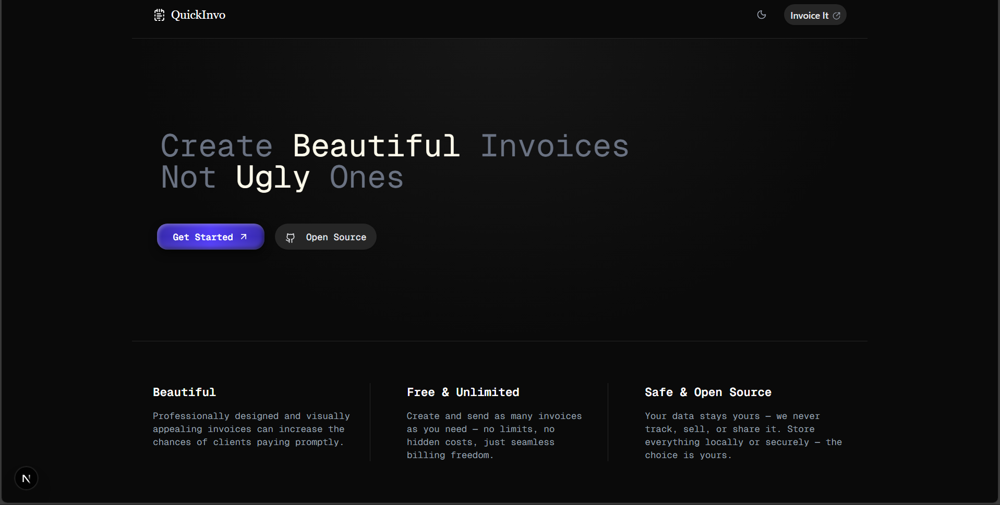
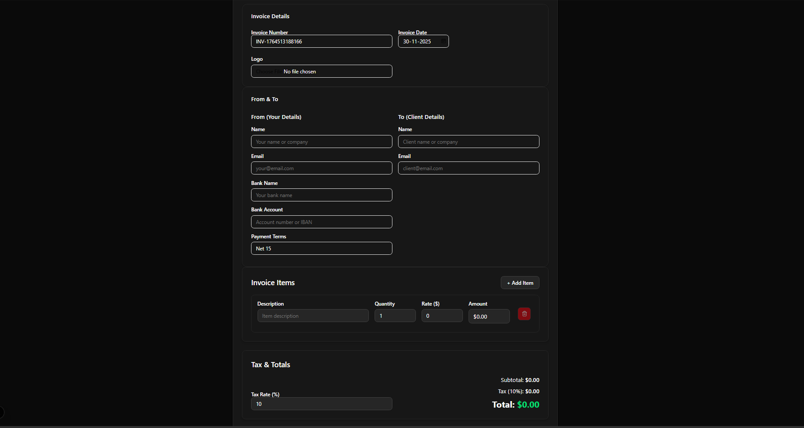

# QuickInvo



## 🚀 Create Beautiful, Freelancer-Friendly Invoices

QuickInvo is a modern, open-source invoice generator built with Next.js and React. It helps freelancers and professionals create stunning, customizable invoices in seconds—no sign-up, no limits, and no ugly templates!

---

## Features

- **Modern, Professional UI**: Clean, dark mode design with mobile responsiveness.
- **Freelancer Friendly**: Add your logo, bank details, payment terms, and more.
- **Live Invoice Preview**: See your invoice update in real time as you edit.
- **PDF Export**: Download your invoice as a polished PDF, ready to send.
- **Unlimited Invoices**: No restrictions, no hidden costs.
- **Open Source & Private**: Your data stays on your device—no tracking, no cloud.

---

## 📱 Mobile Responsive
QuickInvo works perfectly on any device. Create and send invoices from your phone, tablet, or desktop.

---

## Getting Started

1. **Clone the repository:**
	```bash
	git clone https://github.com/neeleshkr22/QuickInvo.git
	cd QuickInvo
	```
2. **Install dependencies:**
	```bash
	npm install
	```
3. **Run the development server:**
	```bash
	npm run dev
	```
4. **Open [http://localhost:3000](http://localhost:3000) in your browser.**

---

## Usage

- Fill in your details, client info, and invoice items.
- Upload your logo for personal branding.
- Preview your invoice live.
- Download as PDF and send to your client.

---

## Technologies Used
- Next.js
- React
- Tailwind CSS
- TypeScript

---

## Contributing

Pull requests and suggestions are welcome! For major changes, please open an issue first to discuss what you would like to change.

---

## Preview



---

**QuickInvo — Create professional invoices, not ugly ones!**
